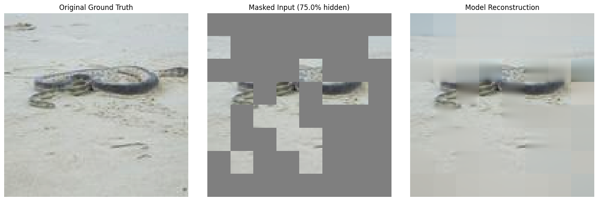
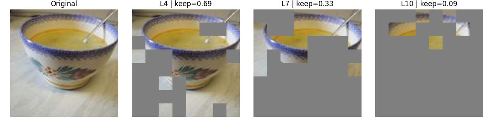

# Dynamic Vision Transformers: Multi-Stage Compression Pipeline

This repository implements a high-performance, multi-stage pipeline for training and compressing Vision Transformers (ViT). By combining Self-Supervised Learning (SSL), Representation Bottlenecks (REPA), and Dynamic Token Pruning, we achieve a **TINY DynamicViT** that maintains high accuracy on ImageNet-1k (128x128) while significantly reducing computational overhead.

---

## Feature Learning & Reconstruction

### Stage 1: Local Feature Extraction (MAE)
We utilize a **Masked Autoencoder (MAE)** objective to force the model to understand local image structures. By masking 75% of input patches, the Teacher ViT learns to reconstruct the missing data, building a robust foundation of local spatial features.

**Strategic Innovation**: Unlike standard Layer-wise Learning Rate Decay (LLRD) which typically increases towards the head, we employ a **decreasing LLRD** during this stage. This prioritizes the optimization of early layers to capture fine-grained local textures.


*Left: Original Image | Center: 75% Masked Input | Right: Model Reconstruction*

---

## The Three-Stage Pipeline

### 1. Self-Supervised Pre-training (MAE)
- **Goal**: Capture local structural information.
- **Method**: Train a Teacher ViT to reconstruct normalized pixel patches.
- **Optimization**: Decreasing LLRD to anchor early-layer representations.

### 2. Semantic Alignment (REPA + Supervised)
- **Goal**: Capture global and semantic features.
- **Method**: Fine-tune the Teacher with labels and **REPA** (Representation Bottleneck). We distill high-level semantic knowledge from a frozen DINO model (DINOv2/v3 features) to ensure a superior feature representation and classification accuracy.
- **Optimization**: Increasing LLRD to refine deep semantic layers and classification heads.

### 3. Compression & Distillation (DynamicViT)
- **Goal**: Create a lightweight, "TINY" inference model with a small bunch of weights.
- **Method**: Distill a Student DynamicViT from the optimized Teacher.
- **Pruning**: The student learns to dynamically drop less informative tokens at layers 4, 7, and 10.
- **Result**: A compressed model with significantly fewer GFLOPs and competitive accuracy.


*Evolution of token pruning masks across transformer layers.*

---

## Installation & Configuration

### Prerequisites
- Python 3.10+
- Recommended: `uv` for lightning-fast dependency management.

```bash
# Clone the repository
git clone <repo_url>
cd Vit-Pytorch

# Using uv (recommended)
uv sync && source .venv/bin/activate

# Using pip
pip install -r requirements.txt
```

### Environment Setup
Create a `.env` file in the root directory to specify your dataset cache location. See `.env.example` for details:
```bash
HF_DATASETS_CACHE=path/to/your/data/cache
```

---

## Core Usage (ImageNet 128x128)

All scripts must be run as modules from the project root using the `-m` flag.

**1. SSL Pre-training**
```bash
python -m src.train.train_teacher_SSL --dataset imagenet --mask_ratio 0.75
```

**2. Teacher Fine-tuning (with REPA)**
```bash
python -m src.train.train_teacher --dataset imagenet --resume-from checkpoints/imagenet/ssl_teacher/ssl_teacher_best.pth
```

**3. Student Distillation & Pruning**
```bash
python -m src.train.train_student --dataset imagenet --rho 0.7 --run_name tiny_dynamic_vit
```

**4. Evaluation & Benchmarking**
```bash
# Compare Teacher vs Student performance
python -m src.test.compare_st-te --test-teacher --test-student

# Calculate GFLOPs/Parameters
python -m src.test.parameters_computing --dataset imagenet
```

---

## 📊 Evaluation Metrics

| Metric | Description |
|--------|-------------|
| **Top-1 Accuracy** | Percentage of correct class predictions on the test set. |
| **MSE / MAE** | Mean Squared Error and Mean Absolute Error for SSL reconstruction quality. |
| **PSNR** | Peak Signal-to-Noise Ratio (dB) measuring reconstruction fidelity. |
| **GFLOPs / GMACs** | Billion floating point operations and multiply-accumulate operations per image. |
| **Throughput** | Inference speed measured in images per second (img/sec). |
| **Pruning Ratio ($\rho$)** | The target percentage of tokens retained at each pruning stage. |

---

## 📁 Project Structure

```text
Vit-Pytorch/
├── checkpoints/           # Trained model weights (.pth)
│   └── imagenet/          # ImageNet-1k checkpoints (SSL, Teacher, Student)
├── configs/               # Hyperparameters for training & fine-tuning
├── data/                  # Data loading and preprocessing logic
│   ├── load/              # Dataset loaders (ImageNet, STL, CIFAR)
│   └── images/            # Sample visualization images
├── helper_function/       # Utilities (LLRD, print, MAE tools, model loaders)
├── logs/                  # Training logs, plots, and visualizations
│   └── imagenet/          # ImageNet-specific results (results, pruning, SSL)
├── src/                   # Main source code
│   ├── finetuning/        # LoRA fine-tuning logic
│   ├── models/            # Architecture (ViT, DynamicViT, Predictor, Embeddings)
│   ├── test/              # Evaluation and analysis scripts
│   └── train/             # Multi-stage training pipeline (SSL, REPA, Student)
├── .env                   # Local configuration (e.g. data paths)
├── pyproject.toml         # Dependency management (uv)
└── README.md              # Project documentation
```

---

## Citation & References

If you use this implementation, please cite the original DynamicViT paper and the REPA methodology:

```text
@article{rao2021dynamicvit,
  title={DynamicViT: Efficient Vision Transformers with Dynamic Token Sparsification},
  author={Rao, Yongming and Zhao, Wenliang and Liu, Benlin and Lu, Jiwen and Zhou, Jie and Hsieh, Cho-Jui},
  journal={arXiv preprint arXiv:2106.02034},
  year={2021}
}

@article{hsu2023repa,
  title={Revisiting Feature Prediction for Learning Visual Representations},
  author={Hsu, Chih-Hui and others},
  journal={arXiv preprint arXiv:2303.11111},
  year={2023}
}
```

For a full technical report on on our previous implementation (without REPA), see [**Projet_ViT.pdf**](Projet_ViT.pdf).
