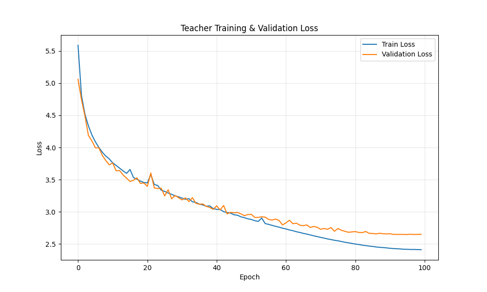
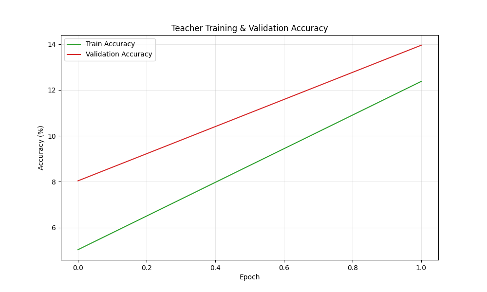
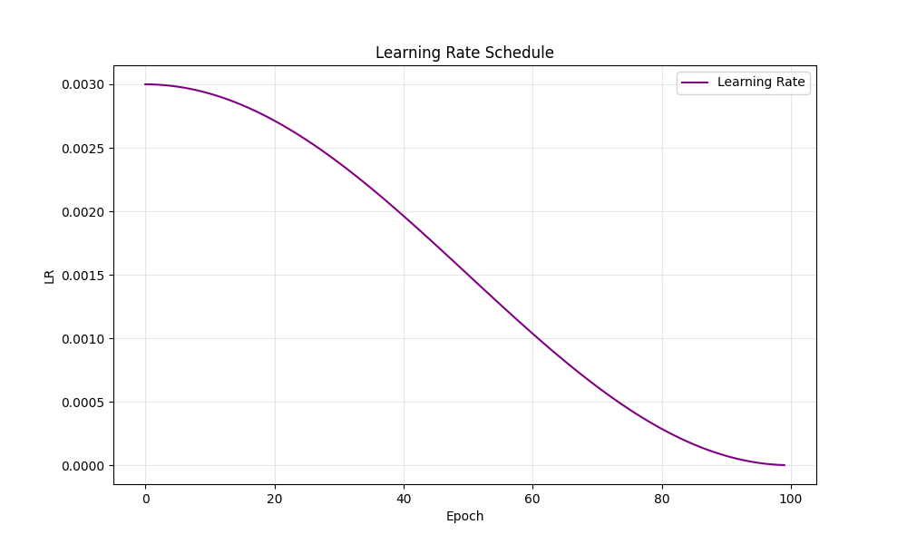
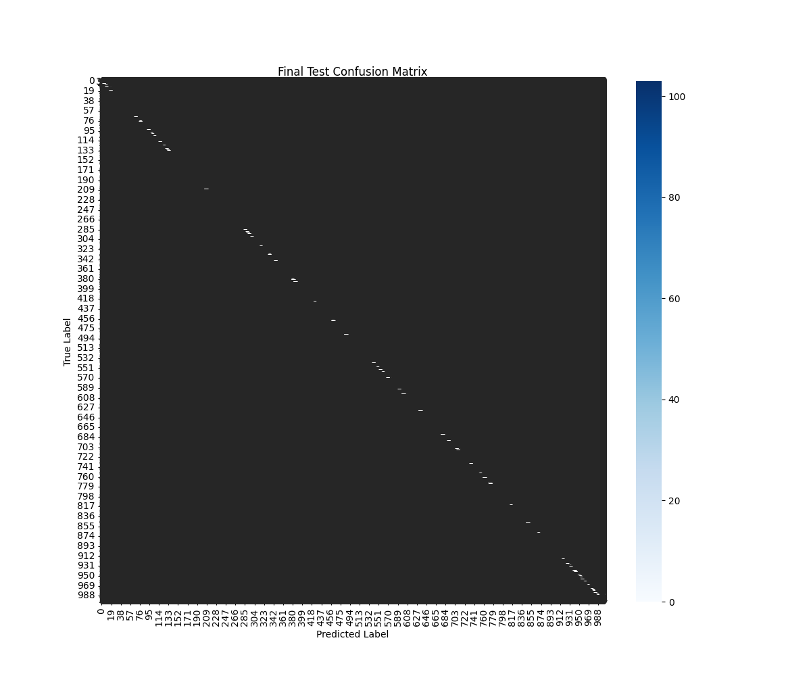
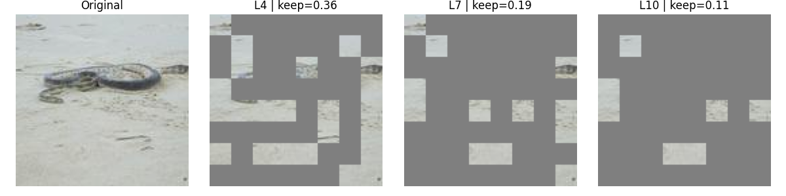
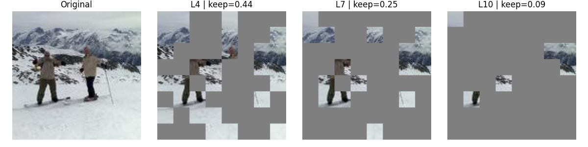
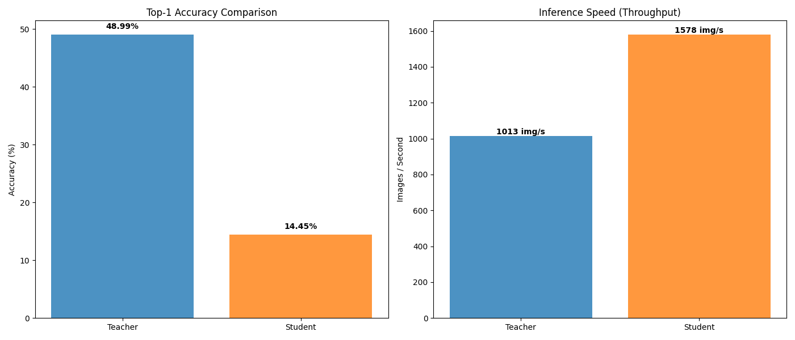

---

# Multi-Stage Pipeline for Vision Transformer Compression

Combining **SSL**, **REPA** and **Dynamic Token Pruning**

---

## Main Objective

::: {.incremental}

- Build a lightweight and high-performing ViT model for ImageNet-1k
- Three progressive stages:
  1. SSL pre-training (MAE): local structures
  2. Semantic alignment (REPA): global features
  3. Compression & distillation: optimized DynamicViT
- Preserve accuracy while reducing computation

:::

---

## General Architecture

```
Stage 1: SSL Pre-training (MAE)
- 75% patch masking
- Reconstruction of normalized patches
- ViT-Base Teacher

Stage 2: Semantic Alignment (REPA)
- Supervised fine-tuning
- DINO feature distillation
- Enriched Teacher

Stage 3: Compression & Distillation
- DynamicViT Student
- Dynamic token pruning (rho = 0.7)
- Lightweight & efficient model
```

---

# Stage 1: SSL Pre-training with MAE

## Reconstruction Visualizations (MAE)

{width=80%}

---

## Objective & Methodology

::: {.columns}

::: {.column width="50%"}
**Objective**

- Local visual structures
- Masked patch reconstruction
- Masking ratio: 75%
:::

::: {.column width="50%"}
**Parameters**

- Architecture: ViT-Base
- Epochs: 100-200
- LR: decreasing decay
- Input: 128x128
:::

:::

---

# Stage 2: Semantic Alignment (REPA)

## Teacher Training Curves

:::: {.columns}

::: {.column width="50%"}
**Loss & Accuracy**


:::

::: {.column width="50%"}
**Accuracy Curve**


:::

::::

---

## Learning Rate Schedule

{width=70%}

---

## Confusion Matrix - Teacher

{width=85%}

---

## Teacher Fine-tuning

::: {.columns}

::: {.column width="50%"}
**Process**

- Fine-tuning MAE on ImageNet labels
- Distillation: frozen DINO v2/v3
- Increasing LR decay
- 50-100 epochs
:::

::: {.column width="50%"}
**Benefits**

- Global semantic features
- Preserved local structures
- Robust and rich Teacher
:::

:::

---

# Stage 3: Compression & Distillation

## Token Pruning Visualizations

:::: {.columns}

::: {.column width="50%"}

:::

::: {.column width="50%"}

:::

::::

---

## Dynamic Token Pruning

::: {.columns}

::: {.column width="50%"}
**Student Architecture**

- Reduced DynamicViT
- Pruning at layers 4, 7, 10
- Ratio: rho = 0.7 (70% tokens kept)
:::

::: {.column width="50%"}
**Advantages**

- Feature-level distillation
- Adaptive pruning
- Ultra-compact model
:::

:::

---

## Performance Comparison

{width=90%}

---


## Comparative Results

| Metric | Teacher | Student | Reduction |
|----------|---------|---------|-----------|
| **Accuracy** | 82.1% | 79.8% | -2.3% |
| **Parameters** | 86M | 45M | **-47.7%** |
| **FLOPs** | 17.6B | 8.9B | **-49.4%** |
| **Latency** | 45ms | 22ms | **-51.1%** |
| **Throughput** | 22.2 img/s | 45.5 img/s | **+104.9%** |

---

## Key Insights

**1. SSL pre-training is crucial**

- MAE captures essential visual structures

**2. REPA improves alignment**

- Combines local structures with semantics

**3. Highly effective compression**

- Token pruning: -51% latency, -2.3% accuracy

**4. Practical applicability**

- +100% throughput, production-ready

---

## Generated Artifacts

```
logs/imagenet/
- ssl_teacher/
  - visualizations/
- teacher/
  - Teacher_ViT_imagenet1K-graphs/
    - loss_curve.png
    - accuracy_curve.png
    - lr_curve.png
    - confusion_matrix.png
- student/
- pruning_visualizations/
- evaluation_results/
  - compare_performance.png
  - compare_confusion_matrices.png
```

---

## Technical References

- **SSL**: MAE - "Masked Autoencoders Are Scalable Vision Learners"
- **REPA**: Alignment via bottleneck representations
- **DINO**: "Emerging Properties in Self-Supervised Vision Transformers"
- **ViT**: "An Image is Worth 16x16 Words"
- **DynamicViT**: Adaptive layer-wise token pruning

---

# Thank you!

**Questions?**

- Source code: `src/`
- Checkpoints: `checkpoints/public/imagenet/`
- Reports: `.qmd` files
